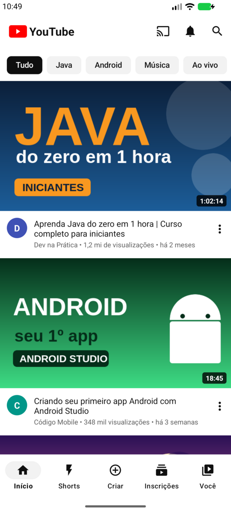
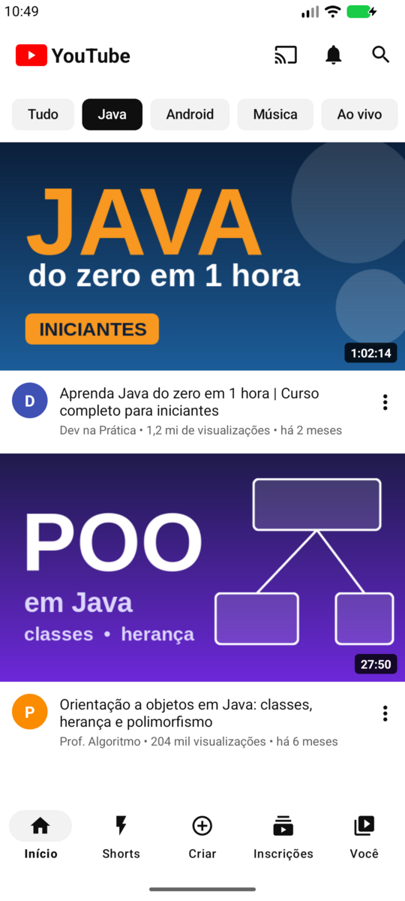
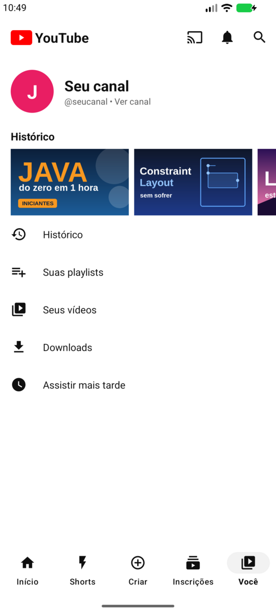
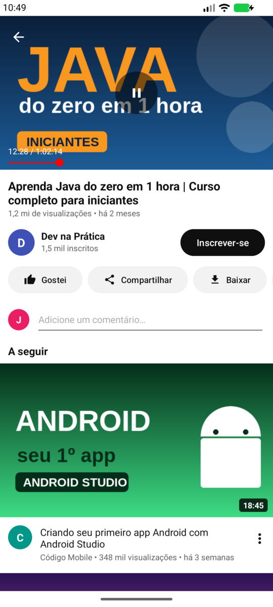

# YouTube UI – AD2

Atividade de Aprendizagem a Distância 2 (AD2) da disciplina de Programação para Dispositivos Móveis (TSI – IFC Camboriú).

A proposta era implementar a interface gráfica de um aplicativo à escolha. Escolhi o YouTube, com duas telas: o feed inicial e a tela do player. O projeto é só de interface, então vídeos, canais e visualizações são dados de exemplo.

| Feed inicial | Filtro por categoria | Aba "Você" | Tela do player |
|---|---|---|---|
|  |  |  |  |

## Demonstração

Vídeo curto (cerca de 16 s) do app rodando no emulador: filtro por categoria, abertura do player e a aba "Você".

https://github.com/user-attachments/assets/3905ad57-3c70-4029-989a-fd529dcb7b7f

O link do vídeo precisa ficar sozinho na linha, com uma linha em branco antes e outra depois. Só assim o GitHub mostra o player.

## Elementos de interface utilizados

**Tela inicial (`activity_main.xml`)**
- `ConstraintLayout` como container principal.
- `MaterialToolbar` com o logo e o menu (transmitir, notificações, pesquisa).
- `ChipGroup` dentro de um `HorizontalScrollView`: tocar em um chip filtra a lista.
- `RecyclerView` com a lista de vídeos; cada item (`item_video.xml`) usa `ImageView`, `TextView` e `ImageView` como botão.
- `BottomNavigationView` com Início, Shorts, Criar, Inscrições e Você. As abas **trocam a tela de verdade**: Início mostra o feed, Você mostra o perfil (com `ScrollView` e faixa de histórico) e as demais mostram uma tela de "em breve". O botão Voltar leva de volta ao Início.

**Tela do player (`activity_watch.xml` e `header_watch.xml`)**
- `ConstraintLayout` com `Guideline` para alinhar os controles.
- `MaterialToolbar` sobre o vídeo, com o botão de voltar.
- `ImageView` (miniatura), `ImageButton` (play/pause) e `SeekBar` com o tempo em `TextView`. A barra avança sozinha enquanto o vídeo está "reproduzindo".
- `Button` (Inscrever-se, Gostei, Compartilhar, Baixar, Salvar) e `EditText` para comentário.
- `ListView` com os vídeos de "A seguir", usando um `ArrayAdapter` próprio.

A navegação entre as telas usa `Intent` para abrir a `WatchActivity`.

O projeto usa Java e layouts em XML, como visto na disciplina. Os textos da interface e os dados de exemplo dos vídeos ficam em `res/values/strings.xml`, e as miniaturas (`res/drawable-nodpi`) e os ícones vetoriais (`res/drawable`) são locais, então não há imagens externas.

## Como executar

Requisitos: Android Studio Otter (2025.2) ou mais novo. O projeto usa Android Gradle Plugin 8.13, Gradle 8.13 e JDK 21 (o JDK que já vem no Android Studio serve), e a versão mínima do Android é a 7.0 (API 24).

1. Abrir esta pasta no Android Studio (**File > Open**).
2. Aguardar a sincronização do Gradle.
3. Executar no emulador ou em um celular Android.

Ou pela linha de comando:

```bash
./gradlew assembleDebug
```

O APK gerado fica em `app/build/outputs/apk/debug/`.

## Estrutura

```
app/src/main/
├── java/com/example/youtubeui/
│   ├── MainActivity.java        feed, chips e navegação inferior
│   ├── WatchActivity.java       tela do player
│   ├── VideoAdapter.java        adapter do RecyclerView
│   ├── VideoListAdapter.java    adapter da ListView
│   ├── Video.java               modelo (guarda ids de recursos)
│   └── VideoData.java           dados de exemplo
└── res/
    ├── layout/                  telas (feed, player, você, em breve) e itens
    ├── menu/                    toolbar e barra inferior
    ├── drawable/                ícones vetoriais
    ├── drawable-nodpi/          miniaturas dos vídeos
    └── values/                  cores, textos e estilos
```
